---
title: 数学公式及表格总结
date: 2019-03-14
tags: 
	数学公式
	图表
categories: Math
mathjax: true

---

Hexo博文的编写主要基于**Markdown**语言。**StackEdit**作为一款在线**Markdown**编写程序，有强大的数学兼容性，后续文章的编辑主要依靠**StackEdit＋Mou**完成。这里将展示如何用 **StackEdit**编写：

- 基本数学公式；
- 简单图表。

<!-- more -->
## 基本数学公式

- 行内公式$y=\alpha_1$（希腊），$\mathbf{B}$（粗体），$\mathscr{C}$（剧本字体），$\mathcal{D}$（手写），$\mathfrak{E}$（德国），$\mathbb{R}$（黑板粗体）
- 单行公式$$x= \int_0^1 \frac{y(t)}{5}{\rm d}t $$
- 多行公式
	- 使用"aligned":
	$$\begin{aligned}
H(Y|X)& = \sum_{x\in X} p(x)H(Y|X)\\
& = -\sum_{x\in X} p(x)\sum_{y\in Y}p(y|x)\log p(y|x)\\
& = -\sum_{x\in X} \sum_{y\in Y}p(y,x)\log p(y|x)
\end{aligned}$$

	- 使用"equation+split":
$$
\begin{equation}\begin{split}
H(Y|X)&=\sum_{x\in X} p(x)H(Y|X)\\
&=-\sum_{x\in X} p(x)\sum_{y\in Y}p(y|x)\log p(y|x)\\
&=-\sum_{x\in X} \sum_{y\in Y}p(y,x)\log p(y|x)
\end{split}\end{equation}
$$
	- 使用"eqnarray":(Maxwell equs)
	$$
\begin{eqnarray}
\nabla\cdot\vec{E} &=& \frac{\rho}{\epsilon0} \\
\nabla\cdot\vec{B} &=& 0 \\
\nabla\times\vec{E} &=& -\frac{\partial B}{\partial t} \\
\nabla\times\vec{B} &=& \mu0\left(\vec{J}+\epsilon_0\frac{\partial E}{\partial t} \right)
\end{eqnarray}
$$

- 简单矩阵
$$\begin{pmatrix}
1&0&0\\
0&1&0\\
0&0&1\\
\end{pmatrix}$$

- 复杂矩阵
$$\begin{bmatrix}
1 & a _1 & a _1 ^2 & \cdots  & a _1 ^n \\
1 & a _2 & a _2 ^2 & \cdots  & a _2 ^n \\
\vdots & \vdots & \vdots & \ddots & \vdots \\
1 & a _n & a _n ^2 & \cdots & a _n ^n \\
\end{bmatrix}
$$

## 简单图表
- 使用"array"
$$\begin{array}{c|lll}
{↓}&{a}&{b}&{c}\\
\hline
{R_1}&{c}&{b}&{a}\\
{R_2}&{b}&{c}&{c}\\
\end{array}$$

- 使用SmartyPants

|                |ASCII                          |HTML                         |
|----------------|-------------------------------|-----------------------------|
|Single backticks|`'Isn't this fun?'`            |'Isn't this fun?'            |
|Quotes          |`"Isn't this fun?"`            |"Isn't this fun?"            |
|Dashes          |`-- is en-dash, --- is em-dash`|-- is en-dash, --- is em-dash|

- 使用"mermaid"中的"sequenceDiagram"构造图

```mermaid
graph LR
A[Square Rect] -- Link text --> B((Circle))
A --> C(Round Rect)
B --> D{Rhombus}
C --> D
```

<!--stackedit_data:
eyJoaXN0b3J5IjpbLTE0NjExMDMwNiwtMTk5MzQxNjUwNCwxOD
YxODk4MjM0LDE3NTQ5MjIwMzcsMTMyNzU0OTI5OSwyNjY5ODIw
MzBdfQ==
-->